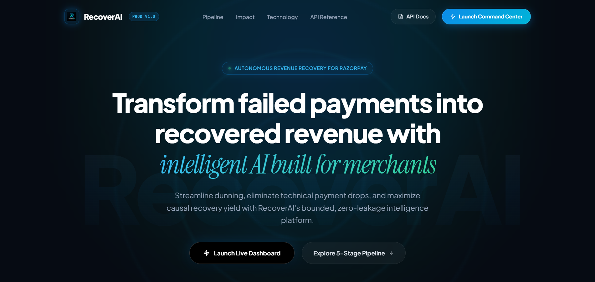
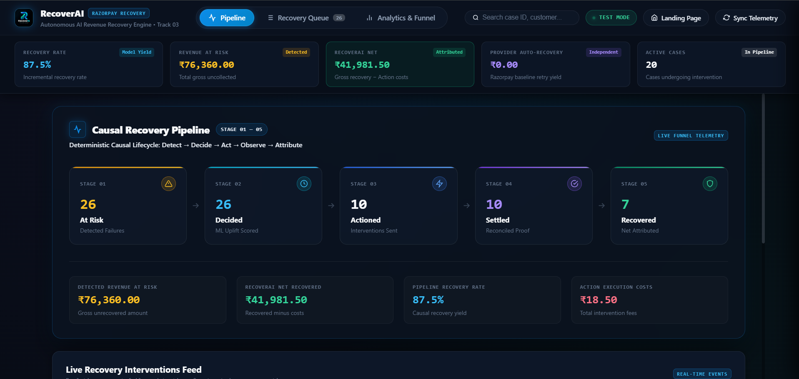
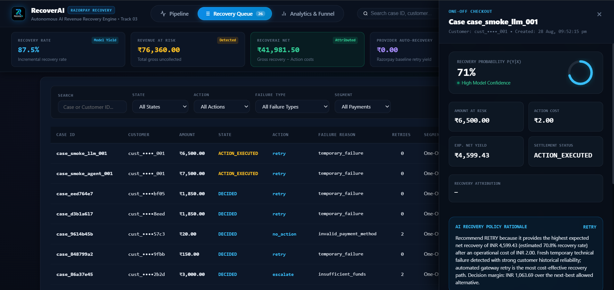
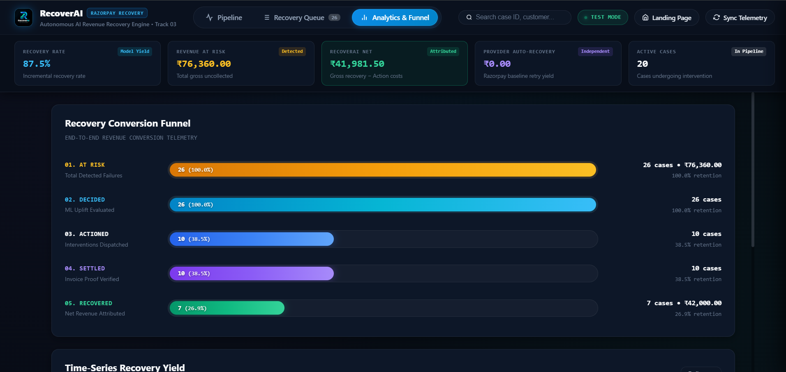
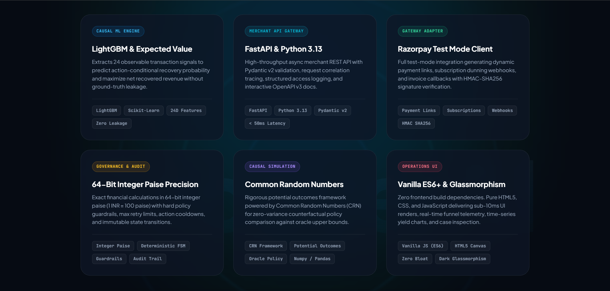

# RecoverAI — Autonomous AI Revenue Recovery Engine

> **Core Product Promise**: *Find revenue that's slipping away and win it back.*

Built for the **Razorpay Buildathon (Track 03: AI Revenue Recovery)**.

<p align="center">
  
</p>

<p align="center">
  
  
  
  
  
  
</p>

---

## 1. Overview & Problem

In modern commerce and subscription businesses, **5–15% of transactions fail** due to transient technical errors, customer balance issues, outdated payment methods, or operational friction. 

Standard industry recovery approaches rely on crude heuristics:
- **Blanket Retries**: Spam gateways, burn API retry fees, and degrade bank health scores without addressing customer root cause.
- **Spam Notifications**: Send premature payment links or generic reminders that annoy customers and increase churn.
- **Manual Escalations**: Deploy expensive support operations on low-value tickets where operational friction exceeds the transaction value.

**RecoverAI** replaces static heuristics with an **economically bounded, causal machine learning decision engine and operational recovery workflow**. It evaluates observable payment context, predicts action-conditional recovery probabilities $P(Y(a)=1 \mid X)$, computes expected net recovery in integer paise, executes interventions bounded by hard safety guardrails, and tracks observed outcomes through an idempotent state machine.

---

## 2. System Architecture & Flow

```
+-------------------------------------------------------------------------------+
|                       1. OBSERVABLE PAYMENT INCIDENT (X)                      |
|                                                                               |
|  PaymentCase:                                                                 |
|    - amount_paise (int), payment_method, failure_type, retry_count            |
|    - hours_since_failure, customer history (success rate, failures, tenure)   |
|    - is_subscription                                                          |
+---------------------------------------+---------------------------------------+
                                        |
                                        v
+-------------------------------------------------------------------------------+
|                    2. LEAKAGE-SAFE FEATURE EXTRACTION (24D)                   |
|                                                                               |
|  - Validates case against strict observable allowlist (Fail-Closed)           |
|  - Deterministic transformations (log amounts, elapsed time, one-hot encodings)|
|  - Zero access to hidden ground truth, latent states, or future outcomes      |
+---------------------------------------+---------------------------------------+
                                        |
                                        v
+-------------------------------------------------------------------------------+
|              3. ACTION-CONDITIONAL POTENTIAL-OUTCOME MODELS                   |
|                                                                               |
|  For each candidate action a in {no_action, retry, link, reminder, escalate}: |
|    X -> Model_a -> P_hat(Y(a)=1 | X) in [0.0, 1.0]                           |
+---------------------------------------+---------------------------------------+
                                        |
                                        v
+-------------------------------------------------------------------------------+
|                 4. EXPECTED NET VALUE ENGINE (Exact Integer Paise)            |
|                                                                               |
|  For each candidate action a:                                                 |
|    Expected Gross (paise) = floor(P_hat(Y(a)=1 | X) * amount_paise)           |
|    Expected Net (paise)   = Expected Gross - ACTION_COSTS_PAISE[a]            |
+---------------------------------------+---------------------------------------+
                                        |
                                        v
+-------------------------------------------------------------------------------+
|                       5. SAFETY GUARDRAILS & POLICY CONSTRAINTS               |
|                                                                               |
|  - NO_ACTION is ALWAYS available (lower bound safety fallback)                |
|  - If retry_count >= 2: RETRY is suppressed (prevents gateway fatigue)        |
|  - If amount < INR 200: ESCALATE is suppressed (prevents fee burning)         |
|  - Decision: argmax_{a in Allowed} Expected Net (paise)                       |
+---------------------------------------+---------------------------------------+
                                        |
                                        v
+-------------------------------------------------------------------------------+
|                       6. MERCHANT API & RECOVERY OPERATIONS                   |
|                                                                               |
|  - POST /api/v1/decisions -> Recommended Action, Expected Net Value, Margins  |
|  - POST /api/v1/recovery/actions -> Idempotent Action Provider Execution      |
|  - POST /api/v1/recovery/outcomes -> Settlement Events & State Transitions    |
|  - GET  /api/v1/recovery/summary  -> Observational Operational & Financial KPI|
+-------------------------------------------------------------------------------+
```

---

## 3. Visual Interface & Merchant Command Center

RecoverAI provides a dual-surface experience: a **High-Converting Product Landing Page** (`/landing`) and an **Autonomous Merchant Recovery Command Center** (`/dashboard`), built in pure Vanilla ES6+ and Dark Glassmorphism with zero external frontend build dependencies.

### A. Product Landing Page (`GET /landing`)
The landing page introduces merchants to the 5-stage causal lifecycle, live recovery benchmarks, and the 6-pillar production architecture.

<p align="center">
  
</p>

---

### B. Causal Recovery Pipeline View (`GET /dashboard` — View 1)
Real-time 5-stage deterministic lifecycle tracking (`DETECT` → `DECIDE` → `ACT` → `OBSERVE` → `ATTRIBUTE`), executive KPI strip with isolated baseline accounting, and live recovery event feed. Clicking any stage card instantly filters the Recovery Queue.

<p align="center">
  
</p>

---

### C. High-Density Recovery Queue & Deep Case Inspection Drawer (`GET /dashboard` — View 2)
Filterable tabular ledger with multi-parameter search (State, Action, Failure Type, Segment). The slide-out deep inspection drawer reveals real-time recovery probability gauges, 2x2 integer paise financial metrics, candidate action evaluation matrices, and full AI policy rationale.

<p align="center">
  
</p>

---

### D. Analytics & 5-Stage Conversion Funnel (`GET /dashboard` — View 3)
End-to-end conversion telemetry visualizing stage retention from initial failure detection to net attributed recovery, paired with time-series settled recovery yield charts.

<p align="center">
  
</p>

---

### E. Enterprise Technology & Architecture Stack
Six-pillar modular architecture designed for high throughput, sub-50ms inference latency, strict financial precision in integer paise, and zero ground-truth data leakage.

<p align="center">
  
</p>

---

## 4. Benchmark Results on Held-Out Test Set (1,500 Cases)

Evaluated under **Common Random Numbers (CRN)** on the frozen `sim_v1` held-out test split (1,500 unseen cases across 300 unseen customers, **₹4,065,306.00 at risk**):

| Policy / Engine | Net Recovery (INR) | Gross Recovery (INR) | Cost (INR) | Delta vs Rule Baseline | Regret vs Oracle | Recovery Rate | Intervention Rate | Oracle Headroom Captured |
| :--- | :--- | :--- | :--- | :--- | :--- | :--- | :--- | :--- |
| **No Action** | ₹66,517.00 | ₹66,517.00 | ₹0.00 | -₹2,638,788.00 (-97.54%) | ₹2,936,714.00 | 2.7% | 0.0% | -885.7% |
| **Rule Baseline** | ₹2,705,305.00 | ₹2,724,137.00 | ₹18,832.00 | -- | ₹297,926.00 | 69.2% | 100.0% | -- |
| **Logistic Decision Engine (Champion)** | **₹2,946,931.00** | **₹2,972,057.00** | **₹25,126.00** | **+₹241,626.00 (+8.93%)** | **₹56,300.00** | **71.3%** | **100.0%** | **81.1%** |
| **GBM Decision Engine** | ₹2,831,319.00 | ₹2,859,193.00 | ₹27,874.00 | +₹126,014.00 (+4.66%) | ₹171,912.00 | 69.6% | 100.0% | 42.3% |
| **Oracle (Benchmark Ceiling)** | ₹3,003,231.00 | ₹3,025,648.00 | ₹22,417.00 | +₹297,926.00 (+11.01%) | ₹0.00 | 72.9% | 88.5% | 100.0% |

### Key Takeaways
- **Massive Causal Uplift**: The Champion Logistic Decision Engine captures **+₹241,626.00 (+8.93%) incremental net recovery** over standard heuristic retries.
- **Oracle Headroom Capture**: Captures **81.1% of the total theoretical headroom** available in the environment.
- **Subgroup Alpha**:
  - **Exhausted Retries (`retries == 2`)**: **+56.2% net recovery uplift** by recognizing gateway exhaustion and pivoting to payment links/escalation.
  - **Recurring Subscriptions**: **+12.3% net recovery uplift** on mandate and card SaaS billing.
  - **Temporary Failures**: **+12.2% net recovery uplift**.

---

## 5. Quickstart & CLI Commands

### A. Run Merchant API Server
Start the production-ready FastAPI recovery decision and operations service:
```bash
uvicorn api.app:app --host 0.0.0.0 --port 8000
```
- Interactive API Docs: `http://localhost:8000/docs`
- Decision Endpoint: `POST /api/v1/decisions`
- Action Execution: `POST /api/v1/recovery/actions`
- Outcome Settlement: `POST /api/v1/recovery/outcomes`
- Operational Summary: `GET /api/v1/recovery/summary`
- Complete Reference: [`docs/API.md`](docs/API.md) | [`docs/RECOVERY_OPERATIONS.md`](docs/RECOVERY_OPERATIONS.md)

### B. Run Live Integration Smoke Tests
```bash
# Test API Decisions:
python scripts/smoke_test_api.py

# Test Full Recovery Operations Lifecycle:
python scripts/smoke_test_operations.py

# Test Merchant Recovery Analytics & Reconciliation:
python scripts/smoke_test_analytics.py

# Test Production Readiness, Correlation ID, and Observability:
python scripts/smoke_test_production_readiness.py

# Test Autonomous Recovery Agent Workflow & Idempotency:
python scripts/smoke_test_agent.py

# Test LLM Tool-Calling Recovery Agent Workflow & Idempotency:
python scripts/smoke_test_llm_agent.py

# Test Razorpay TEST MODE Provider Integration (Opt-in):
python scripts/smoke_test_razorpay.py
```

### C. Run Interactive Demo CLI
Demonstrates real-time observable inference and auditable decision reports across 8 failure scenarios:
```bash
python scripts/demo.py
```

### D. Run Full Test Suite (186 Tests)
```bash
python -m pytest
```

### E. Run Validation Decision Diagnostics
```bash
python scripts/diagnose_decision_gap.py
```

### F. Run Final Benchmark Evaluation on Held-Out Test Split (Mode A)
```bash
python scripts/run_final_test_evaluation.py
```

### G. Run High-Throughput Scale & Stress Benchmark (Mode B)
```bash
# Standard 10,000-case scale benchmark with customer-clustered bootstrap
python scripts/run_scale_benchmark.py --profile standard --batch-size 1024

# Quick smoke benchmark comparing single-case vs batch vectorized throughput
python scripts/run_scale_benchmark.py --profile smoke --compare-single-batch
```

---

## 6. Repository Structure

```
recoverai/
├── agent/                      # Autonomous Recovery Agent & LLM Tool Orchestration Layer
│   ├── models.py               # AgentRun, AgentStep, AgentContext schemas & FailureCategory
│   ├── result.py               # Structured AgentResult schema
│   ├── trace.py                # Auditable AgentTrace & ASCII tree formatter
│   ├── orchestrator.py         # RecoveryAgent public entry point (supports deterministic/LLM)
│   ├── runtime.py              # Stateful AgentRuntime & LLM-compatible AgentModel driver
│   ├── errors.py               # Domain exceptions (ActionMismatchError, etc.)
│   ├── llm/                    # LLM Tool-Calling Orchestrator Package (Milestone 5)
│   │   ├── base.py             # LLMProvider ABC, LLMMessage, LLMResponse, LLMToolCall
│   │   ├── prompts.py          # Versioned injection-resistant system prompts & context formatters
│   │   ├── validator.py        # ToolCallValidator (Hard semantic validation & safety boundaries)
│   │   ├── model.py            # LLMAgentModel strategy driver
│   │   └── providers/          # Pluggable MockLLMProvider, OpenAI, Anthropic, Gemini providers
│   └── tools/                  # Approved tool registry & execution wrappers
├── analytics/                  # Merchant Analytics & Observability Layer
│   ├── models.py               # Observational analytics schemas & query filters
│   ├── metrics.py              # Exact integer paise calculations & rate utilities
│   ├── repository.py           # SQL aggregation queries over operational records
│   └── service.py              # Analytics service coordinator
├── api/                        # Merchant-Facing FastAPI Recovery Service
│   ├── app.py                  # App factory, lifespan, CORS, error handlers, and routing
│   ├── config.py               # Typed environment configuration & startup validation
│   ├── observability.py        # In-memory thread-safe operational metrics collector
│   ├── schemas.py              # Strict closed Pydantic request/response contracts
│   ├── middleware/             # Request correlation (X-Request-ID) & structured logging
│   ├── routes/                 # API routers (/health, /ready, /model-info, /decisions, /recovery, /analytics, /observability, /agent, /webhooks)
│   └── services/               # RecoveryDecisionService, OperationsService, ExplanationService
├── data/
│   └── sim_v1/                 # Frozen benchmark dataset (Train: 7k, Val: 1.5k, Test: 1.5k)
├── docs/
│   ├── AGENT_ARCHITECTURE.md   # Recovery Agent v0, tools, decision boundary, and trace guide
│   ├── ANALYTICS.md            # Observational analytics definitions & guide
│   ├── API.md                  # Complete Merchant API reference & cURL examples
│   ├── ARCHITECTURE.md         # Layer decoupling & observable boundary diagrams
│   ├── CAUSAL_MODEL.md         # Structural logit model & potential outcomes
│   ├── DECISIONS.md            # Architecture Decision Records (ADRs 001-008)
│   ├── EVALUATION.md           # Formal evaluation metrics & integer paise math
│   ├── LLM_AGENT.md            # LLM tool-calling agent architecture, safety & failure taxonomy
│   ├── ML_SYSTEM.md            # Machine learning decision theory & diagnostics
│   ├── PRD.md                  # Product requirements & KPI definitions
│   ├── PRODUCTION_READINESS.md # Production readiness, error envelopes, and correlation architecture
│   ├── RAZORPAY_INTEGRATION.md # Razorpay TEST MODE integration, webhooks & reconciliation
│   ├── RECOVERY_OPERATIONS.md  # Operations lifecycle, state machine, and provider guide
│   ├── SCALE_EVALUATION.md     # Milestone 7 scale evaluation, vectorization & bootstrap framework
│   ├── SUBSCRIPTION_RECOVERY.md# Milestone 8 subscription recovery, billing cycles & attribution
│   └── DASHBOARD.md            # Milestone 9 Merchant Recovery Command Center guide
├── static/                     # Merchant Recovery Command Center & Landing Page (HTML5, CSS, JS)
│   ├── landing.html            # High-converting product landing page
│   ├── landing.css             # Obsidian & Razorpay blue radiant stylesheet
│   ├── index.html              # Command Center single-page dashboard
│   ├── dashboard.css           # Modern, zero-dependency slate/dark stylesheet
│   └── dashboard.js            # Pure ES6 client with SVG funnel/donut visualizations
├── ml/
│   ├── features.py             # Leakage-safe observable feature extraction (24D preallocated numpy)
│   ├── dataset.py              # Supervised potential-outcome dataset bundles
│   ├── decision_engine.py      # Expected net value optimization, safety guardrails & select_actions_fast
│   ├── inference.py            # Production inference engine & explanation generator
│   ├── evaluation/             # Milestone 7 Scale Evaluation & Profiling Package
│   │   ├── schemas.py          # Strict Pydantic benchmark schemas & latency stats
│   │   ├── workload.py         # Synthetic scale workload generator with CRN ground truth
│   │   ├── bootstrap.py        # Customer-clustered bootstrap with empirical 95% CIs
│   │   ├── profiler.py         # Sub-millisecond stage timing & tracemalloc memory profiler
│   │   ├── subgroups.py        # Subgroup stress matrix across 6 canonical dimensions
│   │   └── harness.py          # ScaleBenchmarkHarness unifying pipeline execution
│   └── models/
│       ├── base.py             # Abstract BaseRecoveryModel
│       ├── logistic_model.py   # Calibrated Logistic Regression model
│       ├── gbm_model.py        # Calibrated HistGradientBoosting model
│       └── bundle.py           # MultiActionRecoveryModel coordinator
├── models/
│   └── champion_recovery_model.pkl # Pre-trained champion model artifact (33.80 KB)
├── recovery/                   # Recovery Operations Domain & Infrastructure
│   ├── models.py               # Case, Decision, Action, Outcome, AgentRun records
│   ├── state_machine.py        # Deterministic state machine & legal transitions
│   ├── repository.py           # SQLite repository with atomic transactions & busy timeout
│   ├── executor.py             # Provider dispatcher & registry
│   ├── actions/                # Provider-agnostic action mocks (retry, link, remind, etc.)
│   ├── providers/              # External payment provider adapters (Razorpay TEST MODE)
│   └── subscriptions/          # Subscription domain models, cycle identity, stopping rules
├── reports/
│   ├── final_test_evaluation.json  # Reproducible test benchmark results (Mode A)
│   ├── final_test_evaluation.md    # Markdown benchmark report (Mode A)
│   ├── m7_scale_benchmark.json     # Milestone 7 scale benchmark results (Mode B)
│   └── m7_scale_benchmark.md       # Milestone 7 scale benchmark report (Mode B)
├── scripts/
│   ├── demo.py                 # Interactive scenario demonstration CLI
│   ├── diagnose_decision_gap.py# Decision gap diagnostic & confusion matrices
│   ├── run_final_test_evaluation.py # Mode A frozen test split evaluation runner
│   ├── run_scale_benchmark.py  # Mode B high-throughput scale benchmark CLI
│   ├── save_champion_model.py  # Export pre-trained champion model artifact
│   ├── smoke_test_api.py       # Live HTTP decision smoke test
│   ├── smoke_test_operations.py# Live HTTP operations lifecycle smoke test
│   ├── smoke_test_analytics.py # Live HTTP analytics smoke test
│   ├── smoke_test_production_readiness.py # Live HTTP production readiness smoke test
│   ├── smoke_test_agent.py     # Live HTTP autonomous recovery agent smoke test
│   ├── smoke_test_llm_agent.py # Live HTTP LLM tool-calling agent smoke test
│   └── validation_decision_comparison.py # Validation comparison runner
├── simulator/                  # Frozen causal simulation environment (sim_v1)
└── tests/                      # 186 unit, integration, security, equivalence, bootstrap, scale & subscription tests (100% passing)
```

---

## 7. Core Scientific & Engineering Principles

1. **Exact Financial Calculations (Integer Paise)**: All internal monetary quantities (`amount_paise`, `recovered_amount_paise`, `intervention_cost_paise`, `expected_net_paise`) are strictly 64-bit integers.
2. **Zero Ground-Truth Leakage Guarantee**: The API and inference path ingest only observable `PaymentCase` fields. Any unauthorized token (`latent_intent`, `latent_funds`, `optimal_action`, `actual_outcome`) immediately raises a `DataLeakageError` or `422 Unprocessable Entity`.
3. **Common Random Numbers (CRN)**: Policies are evaluated against identical realizations of potential outcomes $Y(a)$, guaranteeing that differences in net recovery represent true decision quality rather than stochastic noise.
4. **Customer-Level Split Partitioning**: Train (1,400 customers), Validation (300 customers), and Test (300 customers) are 100% disjoint at the customer identity level.
5. **Stateful Auditability & Idempotency**: Every decision, action dispatch, and observed settlement is persisted with immutable state transitions and unique idempotency keys.